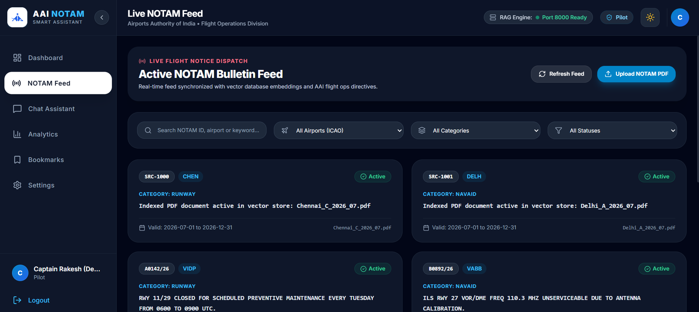
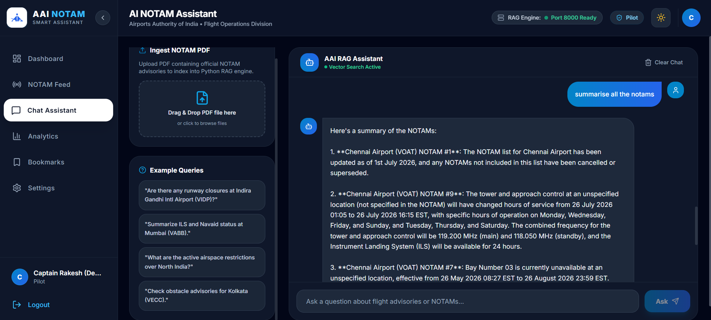
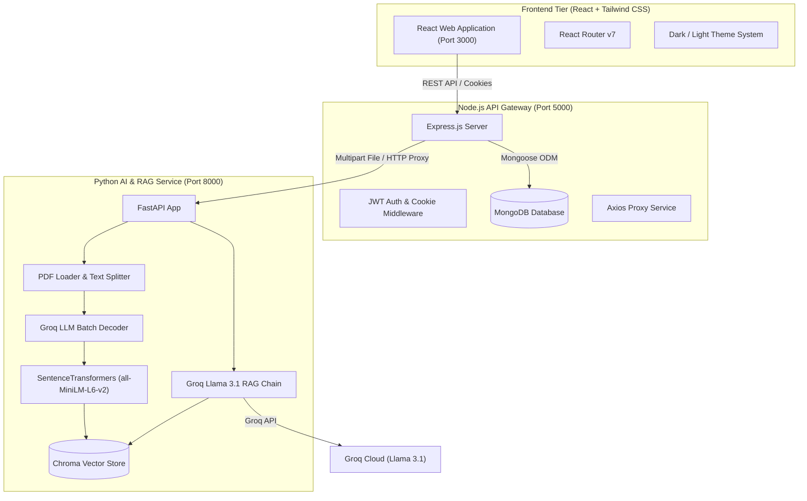

<div align="center">

# ✈️ AAI NOTAM Assistant

### **Intelligent Aviation Information & NOTAM RAG Processing System**

An AI-powered Retrieval-Augmented Generation (RAG) platform built for the **Airports Authority of India (AAI)** and aviation professionals (Pilots, Air Traffic Controllers, and Flight Dispatchers) to ingest, decode, search, and analyze complex Notices to Airmen (NOTAMs) using natural language.

[](#license)
[](https://react.dev/)
[](https://tailwindcss.com/)
[](https://nodejs.org/)
[](https://fastapi.tiangolo.com/)
[](https://www.python.org/)
[](https://groq.com/)
[](https://www.trychroma.com/)
[](https://www.mongodb.com/)

<br/>


</div>

---

## Table of Contents

- [ Overview](#-overview)
- [ Key Features](#-key-features)
- [ Application Screenshots](#-application-screenshots)
- [ System Architecture](#️-system-architecture)
- [ Data & RAG Workflow](#-data--rag-workflow)
- [ Project Structure](#-project-structure)
- [ Tech Stack](#️-tech-stack)
- [ Getting Started](#-getting-started)
  - [Prerequisites](#prerequisites)
  - [1. Environment Setup](#1-environment-setup)
  - [2. Python Backend Setup](#2-python-backend-setup)
  - [3. Node.js Backend Setup](#3-nodejs-backend-setup)
  - [4. Frontend Setup](#4-frontend-setup)
- [ API Reference](#-api-reference)
- [ Aviation Contraction Decoding](#️-aviation-contraction-decoding)
- [ License](#-license)

---

## 📌 Overview

A **NOTAM** (*Notice to Airmen*) contains operational information regarding airspace hazards, runway closures, or navigation facility status. Traditional NOTAM bulletins are dense, heavy with uppercase shorthand contractions, and hard to scan during time-critical flight planning.

**AAI NOTAM Assistant** solves this challenge through microservices and Retrieval-Augmented Generation (RAG):

1. **Automated PDF Bulletin Ingestion**: Upload multi-page official NOTAM PDFs with asynchronous background processing and stage tracking.
2. **AI Contraction Decoding**: Automatically batch-decodes cryptic aviation acronyms (`TWY C CLSD FOR MAINT`, `ILS GP OTS`, `OBST TOWER ERECTED`) into plain English.
3. **Persistent Vector Indexing**: Indexes chunked NOTAMs into **ChromaDB** using local `all-MiniLM-L6-v2` SentenceTransformer embeddings.
4. **Interactive RAG AI Chat**: Powered by **Groq Llama 3.1 8B Instant** for ultra-fast Q&A grounded in official NOTAM sources.
5. **Operations Dashboard**: Real-time stats, severity metrics (Critical, Warning, Info), location filtering, bookmarks, and JWT Role-Based Access Control.

---

## ✨ Key Features

| Feature | Description |
| :--- | :--- |
| **PDF Ingestion** | Upload multi-page NOTAM PDFs with background parsing, PyMuPDF extraction, and progress polling. |
| **Contraction Decoder** | Uses LLM batch inference to translate cryptic aviation shorthand into clear operational text. |
| **RAG AI Assistant** | Ask natural language questions (*"Is Runway 09 closed at VIDP?"*) and get grounded answers with source citations. |
| **Visual Analytics** | Interactive charts powered by Recharts, categorized by severity, ICAO code, and active status. |
| **Bookmarks** | Save high-priority NOTAMs to your personal briefcase for pre-flight pilot briefings. |
| **Authentication & RBAC** | Secure JWT authentication with HTTP-only cookies supporting Pilots, Controllers, Dispatchers, and Admins. |
| **Theme System** | Dark and light design modes built with Tailwind CSS and Lucide icons. |

---

## 📸 Application Screenshots

<div align="center">

### Real-Time Operations Dashboard & Analytics
*Filter active NOTAMs by ICAO airport codes, severity levels, and operational status.*



<br/>

### RAG AI Chat Assistant & NOTAM Decoder
*Ask natural language questions to receive grounded answers with exact source citations and raw NOTAM text toggles.*



</div>

---

## 🏗️ System Architecture

The application adopts a microservice-oriented architecture comprising three main tiers:



---

## 🔄 Data & RAG Workflow

The end-to-end processing pipeline operates across two distinct phases:

### Phase 1: PDF Bulletin Ingestion & Decoding Pipeline
1. **Document Upload**: The user uploads an official multi-page NOTAM PDF bulletin via the React frontend (`POST /api/upload`).
2. **Proxy Delegation**: The Node.js gateway forwards the file stream to the Python FastAPI microservice (`POST /upload`).
3. **Text Extraction & Segmentation**: PyMuPDF parses the raw PDF and splits the bulletin into individual, structured NOTAM blocks based on ICAO headers.
4. **Batch Contraction Decoding**: The Python engine sends raw NOTAM blocks to Groq Llama 3.1 to translate complex aviation shorthand into plain-English explanations.
5. **Vector Embedding & Storage**: `SentenceTransformers` (`all-MiniLM-L6-v2`) converts the decoded text into dense 384-dimensional vector embeddings, which are stored alongside metadata in **ChromaDB**.
6. **Status Notification**: The frontend polls `GET /api/upload/status/:jobId` until parsing completes and refreshes the live NOTAM feed.

### Phase 2: Retrieval-Augmented Generation (RAG) Query Execution
1. **User Query**: The pilot submits a natural language question (e.g., *"Are there any runway closures at Mumbai airport?"*) via the chat interface.
2. **Semantic Search**: The query string is embedded and compared against the persistent ChromaDB collection using cosine similarity to retrieve the top 5 most relevant NOTAM chunks.
3. **Context Assembly**: The retrieved NOTAM text chunks, decoded explanations, and metadata (NOTAM numbers, ICAO codes, dates) are assembled into a structured system prompt.
4. **LLM Generation**: Groq Llama 3.1 generates a concise, accurate answer strictly grounded in the retrieved context.
5. **Response & Citation**: The backend returns the generated answer along with expandable source citation cards referencing exact NOTAM IDs.

---

## 📁 Project Structure

```
notam-assistant/
├── frontend/                            # React 19 Client Application
│   ├── public/                          # Public assets & HTML template
│   └── src/
│       ├── components/                  # Navbar, Sidebar, ProtectedRoute, ThemeToggle
│       ├── context/                     # AuthContext & ThemeContext
│       ├── pages/                       # Dashboard, NotamFeed, ChatAssistant, Analytics, Bookmarks, Login, Signup
│       ├── services/                    # Axios API client modules
│       ├── App.jsx                      # Main app routes & layout
│       └── index.css                    # Tailwind CSS imports & base styles
│
├── node-backend/                        # Express.js API Gateway (Port 5000)
│   ├── server.js                        # Server entry point & database connection
│   └── src/
│       ├── middleware/                  # JWT auth & error handler
│       ├── models/                      # User, Notam, and Bookmark schemas
│       ├── routes/                      # Auth, NOTAM, Upload, Chat, Analytics, Bookmark routes
│       └── services/                    # Microservice HTTP proxy bridge
│
├── python-backend/                      # FastAPI AI & RAG Microservice (Port 8000)
│   ├── main.py                          # FastAPI application & route endpoints
│   ├── create_sample_pdf.py             # Sample PDF generator utility
│   ├── requirements.txt                 # Python dependencies
│   └── src/
│       ├── config.py                    # Vector DB & Groq settings
│       ├── notam_processor.py           # Abbreviation batch decoder
│       ├── pdf_loader.py                # PyMuPDF parser & text splitter
│       ├── rag_chain.py                 # Groq Llama RAG execution chain
│       └── vector_store.py              # ChromaDB vector client
│
└── README.md                            # Project documentation
```

---

## 🛠️ Tech Stack

| Domain | Technology | Usage Description |
| :--- | :--- | :--- |
| **Frontend** | React 19, Tailwind CSS v3 | Responsive dark-mode dashboard interface |
| **Icons & Charts** | Lucide React, Recharts | Dynamic UI icons and analytics charts |
| **API Gateway** | Node.js, Express.js | Request routing, JWT authentication, and MongoDB ODM |
| **Database** | MongoDB & Mongoose | Storage for user accounts, NOTAM metadata, and bookmarks |
| **AI Microservice** | Python 3.10+, FastAPI | Asynchronous RAG processing server |
| **LLM Inference** | Groq Cloud (Llama 3.1 8B) | High-speed LLM for abbreviation decoding & Q&A |
| **Vector DB** | ChromaDB, SentenceTransformers | Local vector embedding (`all-MiniLM-L6-v2`) & search |
| **PDF Extraction** | PyMuPDF (fitz) | Fast PDF document parsing and chunking |

---

## 🚀 Getting Started

### Prerequisites

Ensure you have the following installed:
- Node.js (v18+) & `npm`
- Python (v3.10+) & `pip`
- MongoDB (Local instance at `mongodb://localhost:27017` or MongoDB Atlas URI)
- Groq API Key (Free key from [Groq Console](https://console.groq.com/))

---

### 1. Environment Setup

#### Python Backend (`python-backend/.env`)
```env
GROQ_API_KEY=your_groq_api_key_here
FAA_NMS_CLIENT_ID=your_faa_client_id_if_available
FAA_NMS_CLIENT_SECRET=your_faa_client_secret_if_available
PORT=8000
```

#### Node.js Backend (`node-backend/.env`)
```env
PORT=5000
MONGODB_URI=mongodb://localhost:27017/notam_db
JWT_SECRET=your_jwt_super_secret_key_change_me
PYTHON_SERVICE_URL=http://localhost:8000
```

---

### 2. Python Backend Setup

1. Open terminal in `python-backend/`:
   ```bash
   cd python-backend
   ```
2. Activate virtual environment:
   - **Windows**: `.\venv\Scripts\Activate.ps1`
   - **macOS / Linux**: `source venv/bin/activate`
3. Install dependencies and start server:
   ```bash
   pip install -r requirements.txt
   uvicorn main:app --reload --port 8000
   ```

---

### 3. Node.js Backend Setup

1. Open terminal in `node-backend/`:
   ```bash
   cd node-backend
   ```
2. Install dependencies and start server:
   ```bash
   npm install
   npm run dev
   ```
   > **Default Pilot Credentials**: `pilot.demo@aai.aero` / `Password123`

---

### 4. Frontend Setup

1. Open terminal in `frontend/`:
   ```bash
   cd frontend
   ```
2. Install dependencies and start client:
   ```bash
   npm install
   npm start
   ```
3. Access web dashboard at `http://localhost:3000`.

---

## 🔌 API Reference

### Core Gateway Endpoints (Node.js - Port 5000)

| Method | Endpoint | Description | Auth Required |
| :--- | :--- | :--- | :---: |
| `POST` | `/api/auth/login` | Authenticate user & set JWT cookie | No |
| `GET` | `/api/notam` | Query paginated NOTAMs with search & filters | Yes |
| `POST` | `/api/upload` | Upload NOTAM PDF bulletin | Yes |
| `POST` | `/api/chat/ask` | Submit natural language query to RAG Engine | Yes |
| `GET` | `/api/analytics` | Retrieve stats, severity & ICAO distributions | Yes |
| `POST` | `/api/bookmarks/:notamId` | Toggle bookmark status for a NOTAM | Yes |

---

### AI Microservice Endpoints (Python - Port 8000)

| Method | Endpoint | Description |
| :--- | :--- | :--- |
| `GET` | `/health` | Service status, vector count, and active sources |
| `POST` | `/upload` | Parse PDF bulletin and index vectors into ChromaDB |
| `POST` | `/ask` | Execute Chroma vector search & Groq Llama 3.1 RAG query |
| `DELETE` | `/clear` | Purge vector collection in ChromaDB |

---

## ✈️ Aviation Contraction Decoding

Examples of raw ICAO/AAI NOTAM shorthand automatically decoded by the system:

| Raw Aviation NOTAM Text | Decoded Plain English Explanation |
| :--- | :--- |
| `TWY 'C' CLSD FOR MAINT WEF 2407220400 TO 2407221200.` | **Taxiway 'C' is closed** for maintenance from **22 July 2024, 04:00 UTC** to **22 July 2024, 12:00 UTC**. |
| `RWY 09/27 WIP. EXER CTN DRG LDG/TKOF.` | **Runway 09/27 has work in progress**. Exercise caution during landing and takeoff operations. |
| `ILS GP RWY 28 OTS UFN.` | The **Instrument Landing System (ILS) Glide Path** for Runway 28 is **Out of Service** until further notice. |
| `OBST TOWER ERECTED AT PSN 2833N07706E HGT 150FT AGL LGTD.` | A **temporary tower obstacle** (height 150 ft Above Ground Level) has been erected at coordinates 28°33'N 77°06'E and is lighted. |

---

## 📜 License

Developed for the **Airports Authority of India (AAI)** NOTAM digitization initiative. Internal use and educational project distribution only.
