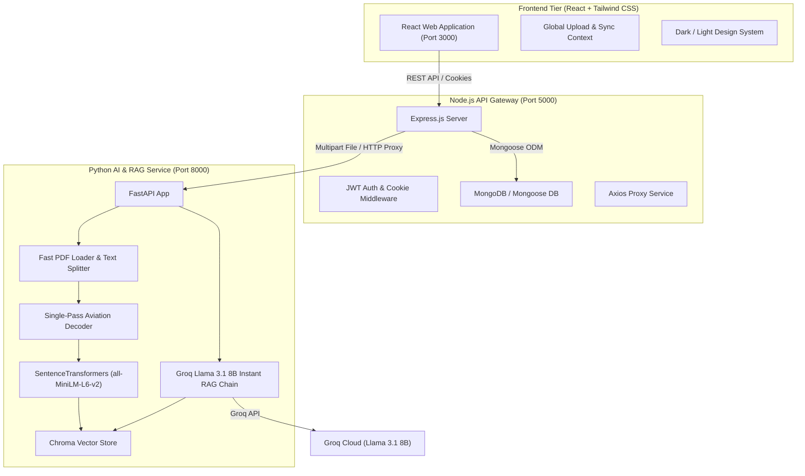

# AAI NOTAM Assistant

> **Intelligent Aviation Information & NOTAM Processing System**  
> An AI-powered Retrieval-Augmented Generation (RAG) platform designed for the **Airports Authority of India (AAI)** and aviation professionals (Pilots, Air Traffic Controllers, and Flight Dispatchers) to ingest, decode, search, and analyze complex Notices to Airmen (NOTAMs) using natural language.

---

## 📋 Table of Contents

- [Overview](#overview)
- [Key Features](#key-features)
- [System Architecture](#system-architecture)
- [Tech Stack](#tech-stack)
- [Getting Started](#getting-started)
  - [Prerequisites](#prerequisites)
  - [1. Environment Setup](#1-environment-setup)
  - [2. Python AI Backend Setup (Port 8000)](#2-python-ai-backend-setup-port-8000)
  - [3. Node.js Gateway Setup (Port 5000)](#3-nodejs-gateway-setup-port-5000)
  - [4. React Frontend Setup (Port 3000)](#4-react-frontend-setup-port-3000)
- [Running the Full Stack](#running-the-full-stack)
- [GitHub Upload Guide](#github-upload-guide)
- [API Reference](#api-reference)
- [License](#license)

---

## 🛫 Overview

A **NOTAM** (Notice to Airmen) contains critical operational information regarding changes, hazards, or closures within airspace or at airports. Traditional NOTAM documents are dense, full of aviation shorthand, and difficult to scan under time-sensitive pre-flight planning conditions.

**AAI NOTAM Assistant** solves this challenge by:
1. **Ingesting PDF NOTAM Bulletins** published by aviation authorities.
2. **Instant Local Abbreviation Expansion**: Rapid single-pass regex expansion converts cryptic shorthand (`RWY`, `CLSD`, `MAINT`, `TWY`, `ILS`, `VOR`, `PAPI`, `U/S`) into plain English.
3. **High-Performance Vector Storage**: Indexes NOTAM chunks into persistent **ChromaDB** using `all-MiniLM-L6-v2` embeddings.
4. **Smart AI Chat Interface**: Powered by **Groq Llama 3.1 8B Instant** to answer pilot queries strictly based on active NOTAMs with source citations.
5. **Modern Operations Dashboard**: Real-time analytics, filtering, bookmarking, and role-based access control.

---

## ✨ Key Features

- **⚡ Ultra-Fast Ingestion Engine**: Instant PDF chunking (< 1 sec) with PyTorch CPU thread capping to prevent system freezing.
- **🌐 Official FAA Live NOTAM Integration**: Fetch real-time international NOTAMs directly from the official FAA NMS-API via parallel multi-airport workers.
- **📌 Global Background Upload Manager**: Floating glassmorphism progress toast tracks background uploads across page navigation (Dashboard, Feed, Chat, Analytics, Bookmarks, Settings).
- **🏷️ Active Data Context Indicator**: Header banner displays real-time loaded sources (`📄 PDF Uploaded`, `🌐 Live FAA Feed`, `⚡ BOTH Active`, or `⚠️ No Context`).
- **Retrieval-Augmented Generation (RAG) Chat**: Ask natural language queries (e.g., *"Is Runway 09 closed at VIDP?"*) with grounded answers and verified NOTAM ID citations.
- **Interactive Analytics & Dashboard**: Visual breakdowns of NOTAMs by severity, airport location, and operational status.
- **Secure Authentication & RBAC**: JWT-based authentication supporting Pilots, ATC Officers, Dispatchers, and Administrators.

---

## 🏗️ System Architecture



---

## 🛠️ Tech Stack

- **Frontend**: React 19, React Router v7, Tailwind CSS, Lucide React, Recharts
- **Node Gateway**: Node.js, Express.js, Mongoose, JWT, Axios, Multer
- **Python AI Engine**: Python 3.11, FastAPI, PyPDF, SentenceTransformers (`all-MiniLM-L6-v2`), ChromaDB, Groq SDK
- **Database**: MongoDB (User accounts, logs, bookmarks) & ChromaDB (Vector embeddings)

---

## 🚀 Getting Started

### Prerequisites
- **Node.js** (v18 or higher)
- **Python** (v3.10 or higher)
- **MongoDB** (Running locally on port 27017 or a MongoDB Atlas URI)
- **Groq API Key** (Free key from [console.groq.com](https://console.groq.com/))

---

### 1. Environment Setup

Create `.env` files in both backend directories.

#### **`node-backend/.env`**
```env
PORT=5000
MONGODB_URI=mongodb://localhost:27017/notam_db
JWT_SECRET=your_secure_jwt_secret_here
PYTHON_BACKEND_URL=http://localhost:8000
NODE_ENV=development
```

#### **`python-backend/.env`**
```env
GROQ_API_KEY=your_groq_api_key_here
FAA_NMS_CLIENT_ID=your_faa_client_id_if_available
FAA_NMS_CLIENT_SECRET=your_faa_client_secret_if_available
```

---

### 2. Python AI Backend Setup (Port 8000)

```bash
cd python-backend

# Create virtual environment
python -m venv venv

# Activate virtual environment
# Windows:
.\venv\Scripts\activate
# Linux/macOS:
# source venv/bin/activate

# Install dependencies
pip install -r requirements.txt

# Start Python FastAPI server
python -m uvicorn main:app --host 127.0.0.1 --port 8000 --reload
```

---

### 3. Node.js Gateway Setup (Port 5000)

```bash
cd node-backend

# Install dependencies
npm install

# Start Node backend server
npm run dev
```

---

### 4. React Frontend Setup (Port 3000)

```bash
cd frontend

# Install dependencies
npm install

# Start React development server
npm start
```

---

## ⚡ Running the Full Stack

1. **Start MongoDB**: Ensure MongoDB service is running on `mongodb://localhost:27017`.
2. **Start Python AI Engine**: `python -m uvicorn main:app --port 8000` (Inside `python-backend/`)
3. **Start Node Gateway**: `npm run dev` (Inside `node-backend/`)
4. **Start React Frontend**: `npm start` (Inside `frontend/`)
5. Open browser at **[http://localhost:3000](http://localhost:3000)**.

---

## 📤 GitHub Upload Guide

Follow these exact steps to push this project to your GitHub repository:

### Step 1: Initialize Git Repository
Open terminal in the project root directory (`d:\AIML\NOTAM-main`):
```bash
git init
```

### Step 2: Add Files & Commit
```bash
git add .
git commit -m "Initial commit: Complete AAI NOTAM Assistant application with RAG engine, live FAA sync, and responsive UI"
```

### Step 3: Create GitHub Repository & Push
1. Go to [GitHub New Repository](https://github.com/new).
2. Name your repository (e.g. `NOTAM-AAI-RAG-Assistant`).
3. Keep it **Public** or **Private**, then click **Create repository**.
4. Copy the repository URL and execute in your terminal:

```bash
git branch -M main
git remote add origin https://github.com/YOUR_USERNAME/YOUR_REPO_NAME.git
git push -u origin main
```

---

## 📡 API Reference

### Python AI Engine (`http://localhost:8000`)
- `GET /health`: Health check and loaded vector sources count
- `POST /upload`: Upload PDF bulletin for background ingestion
- `GET /upload/status/{job_id}`: Poll status of processing job
- `POST /ask`: Query RAG chatbot with natural language
- `POST /faa/live`: Fetch real-time FAA NOTAMs
- `GET /summarize/{filename}`: Generate structured AI summary for a document
- `DELETE /clear`: Clear vector database and reset cache

### Node.js Gateway (`http://localhost:5000`)
- `POST /api/auth/signup`: User registration
- `POST /api/auth/login`: User authentication
- `GET /api/notam/sources`: Proxy loaded vector sources
- `POST /api/chat/ask`: Process user question via Python RAG
- `POST /api/bookmarks`: Create saved NOTAM bookmark
- `GET /api/analytics`: Fetch operational query statistics

---

## 📄 License

Distributed under the MIT License. See `LICENSE` for more information.
